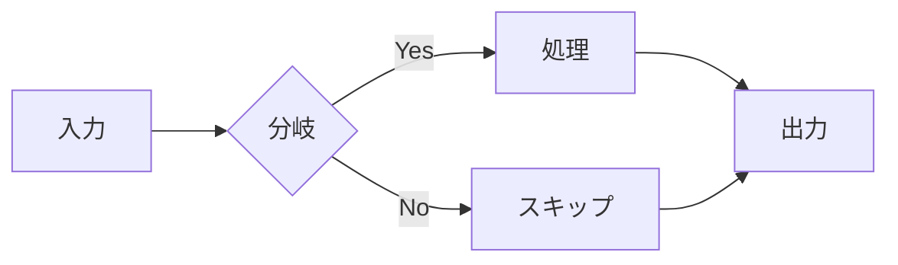
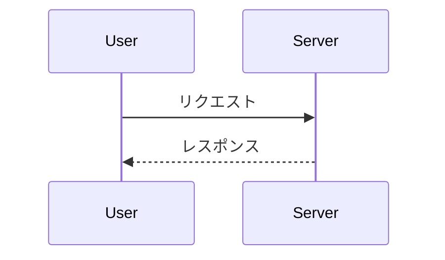
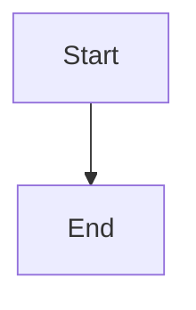

# sekien-pandoc サンプル

## フローチャート



## シーケンス図



## 通常のコードブロック (変換しない)

```rust
fn main() {
    println!("Hello, world!");
}
```

## Div の中の Mermaid (再帰収集の確認)

::: note

:::

## 壊れた Mermaid (graceful fallback の確認)

```mermaid
totallyBogusDiagram
```

## 通常テキスト

- 上の壊れた Mermaid はコードブロックのままHTMLに残るはず
- 他の図は SVG に変換されているはず
