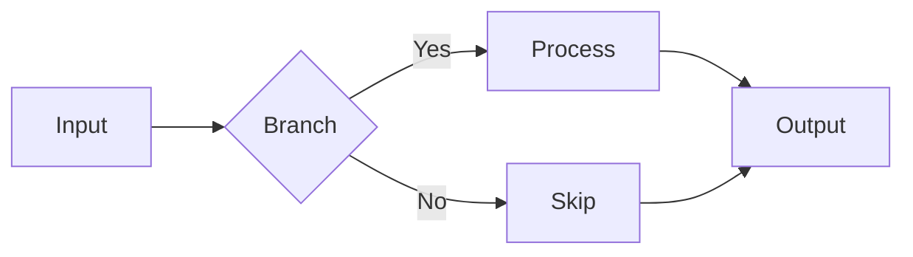
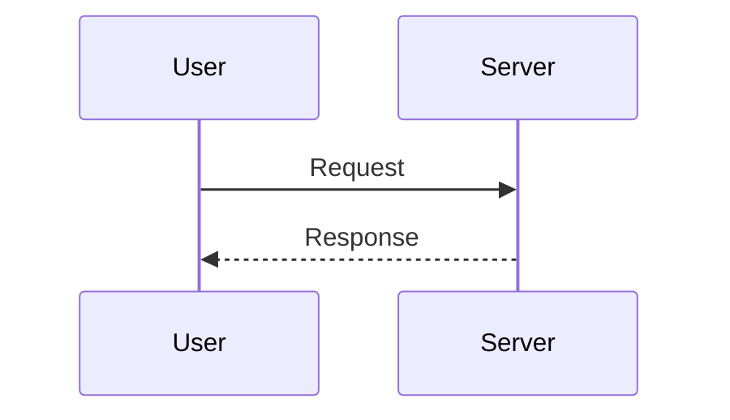
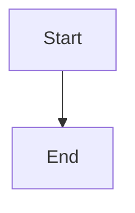

# gazu sample

## Flowchart



## Sequence diagram



## Regular code block (not converted)

```rust
fn main() {
    println!("Hello, world!");
}
```

## Mermaid inside a Div (checks recursive collection)

::: note

:::

## Broken Mermaid (checks graceful fallback)

```mermaid
totallyBogusDiagram
```

## Regular text

- The broken Mermaid above should remain as a code block in the HTML
- The other diagrams should be converted to SVG
