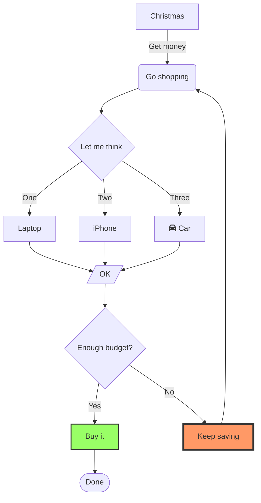
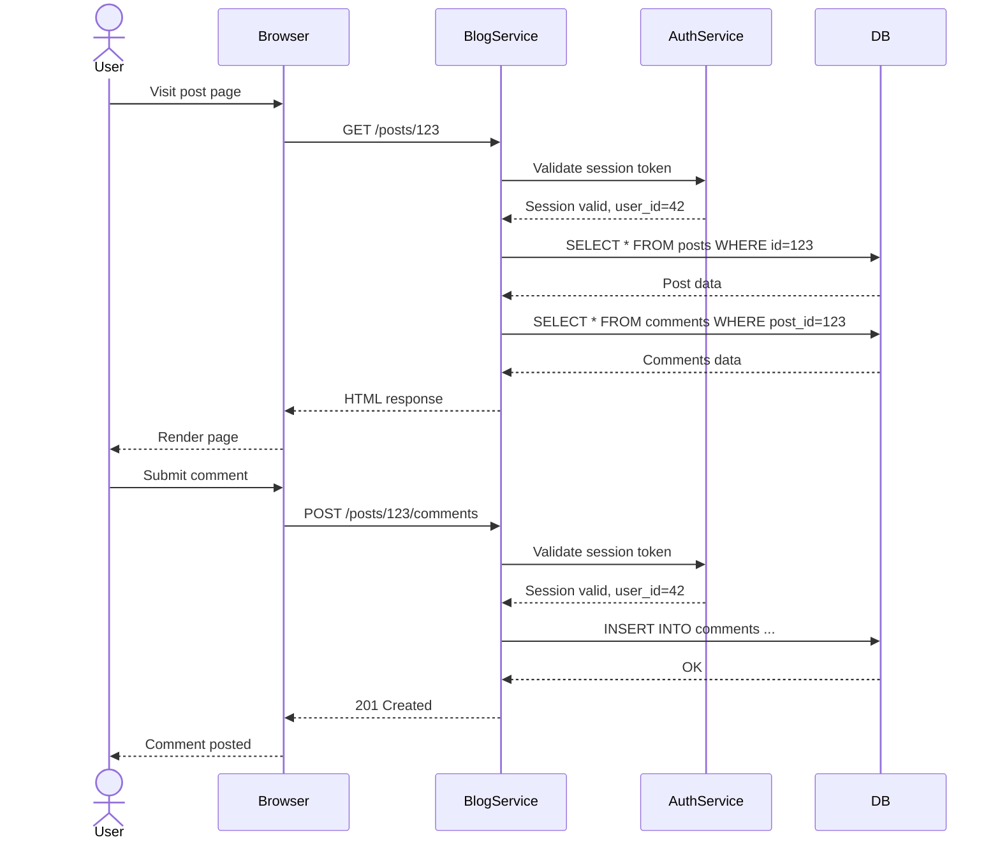
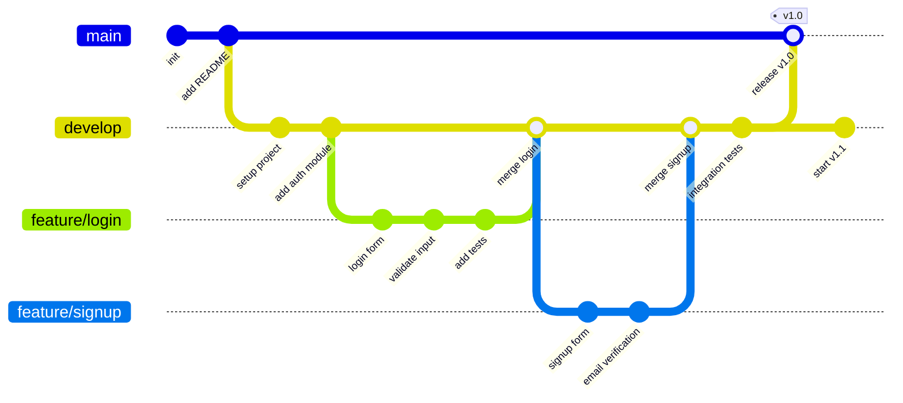

# Benchmark fixture

3 つの Mermaid 図を含む文書。gazu は 1 回の `render_stream` でまとめて
レンダリングするのに対し、mermaid-filter はブロックごとに `mmdc` (Puppeteer)
を起動するため、ブロック数に応じて差が広がる。

## Flowchart

## Sequence diagram

## Git graph

